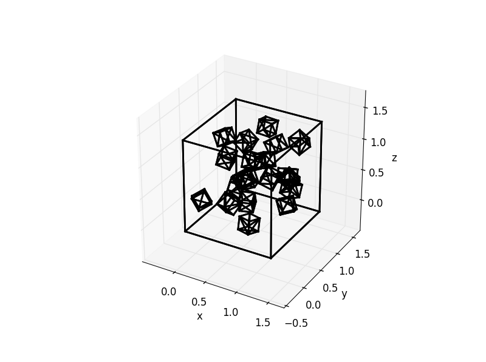

[![License][s1]][li]

[s1]: https://img.shields.io/badge/licence-GPL%203.0-blue.svg
[li]: https://raw.githubusercontent.com/matt77hias/geompy/master/LICENSE.txt

# geompy

## About
A small Python library focussing on visualizing and processing geometry.

## Use
<p align="center">


</p>

```python
# Code
test.test_wireframe_2D()
test.test_wireframe_3D()
```

<p align="center">


</p>

```python
# Code
test.test_ray_triangle_2D()
test.test_ray_triangle_3D()
```

<p align="center">


</p>

```python
# Code
test.test_ray_lines_2D()
test.test_ray_lines_3D()
```
<p align="center">

</p>

```python
# Code
scenegenerator._test_stratified()
```
